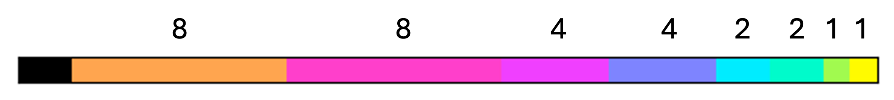
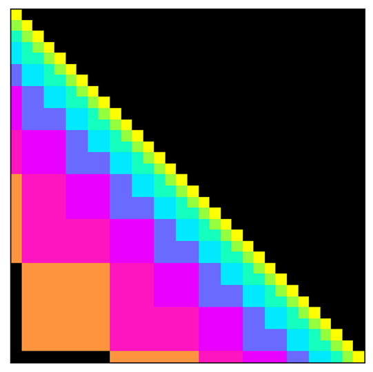
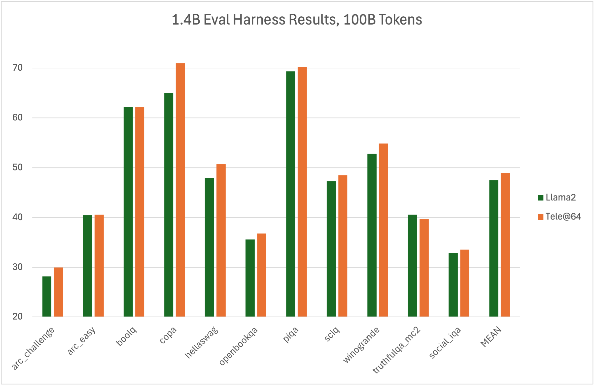
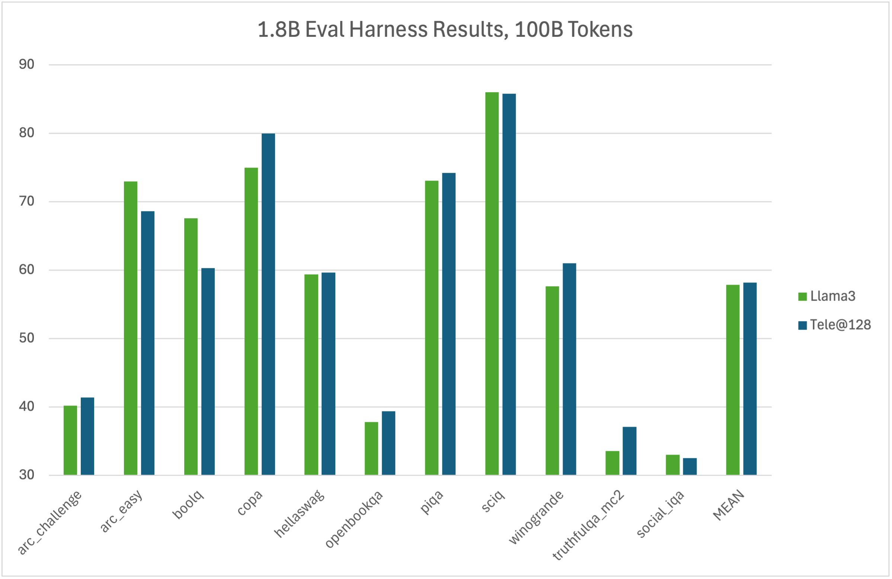

# Telescoping Cache - Compressing K/V Caches to Constant Length

The intuition behind telescoping caches is straightforward: when it comes to generating a token at time _t_, the exact progression of tokens from _t-2_ to _t-1_ matters a lot. 
However, the tokens beyond _t-100_, while important for establishing semantic context, often do not require the same level of specificity. 
Therefore, if we want to shrink a K/V cache to constant size, the most sensible approach is to preserve local tokens while progressively compressing the cache as we get further and further away. 

One way to do this is to have each entry (or group of entries) in the finite-length cache store an average of multiple tokens, with each entry (or group) covering twice as many tokens as the previous. 
Below is a graphical example - we can think of this as analogous to one row of an attention mask diagram.
Here each color represents the range of tokens averaged into a single cache entry:

The problem with this scheme is that it cannot "roll forward" by one token at inference time: we don't know how to re-calculate the new averages given only the previous aggregate values. 

Instead, we allow cache sizes to vary, and merge together two entries at each time step to clear room for the new token. For three time steps, we see that we can stagger merges to preserve the overall compression scheme:

By performing merges in the right predetermined sequence, we can keep to our (softened) compression scheme at all times. The resulting compression/attention pattern is diagonal for local tokens on the diagonal, but becomes progressively less granular / more block-diagonal as we move further away.

Here, the L-shapes represent merges: two values combine into one with twice the coverage, and the existing colors/entries are re-allocated to the previous entries plus the one new token. 

Similar to scan-based and state-space models, this merge/compression pattern admits an efficient though somewhat involved implementation for pretraining in parallel, while also reducing to a very simple RNN-style "update rule" at inference time. Simply merge two values and add the next. In fact, the telescoping cache can be implemented as a Linear Time-Dependent associative scan with non-diagonal update matrices (though this is not the approach taken here).

In small-scale runs (~1.5B-scale Llama models over 100B tokens), telescoping cache models converge to similar or slightly worse values, while demonstrating comparable - and even slightly improved! - scores on lm-eval tasks:

